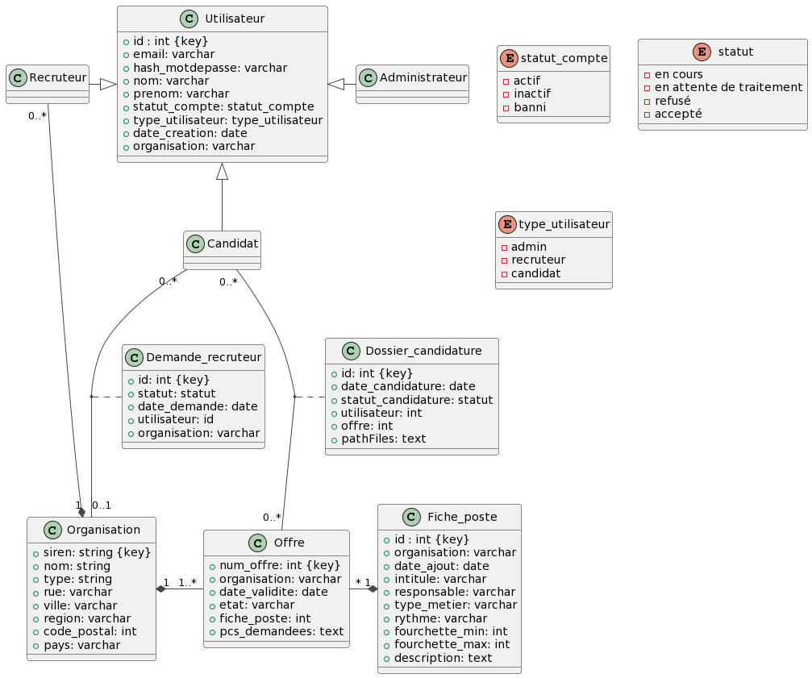

# SR10 Job portal
### Strcuture du projet (MVC)
```
📦 job_platform
├─ app.js
├─ bin
│  └─ www
├─ controllers
│  ├─ authController.js
│  ├─ offresController.js
│  └─ usersController.js
├─ models
│  ├─ db.js
│  ├─ offre.js
│  ├─ org.js
│  └─ user.js
├─ node_modules
|  ├─ ...
|  └─ ...
├─ package-lock.json
├─ package.json
├─ public
│  └─ stylesheets
│     └─ style.css
├─ routes
│  ├─ admin.js
│  ├─ candidats.js
│  ├─ index.js
│  ├─ recruteurs.js
│  └─ users.js
└─ views
   ├─ admin
   │  ├─ dashboard.ejs
   │  ├─ displayUsers.ejs
   │  └─ voirOffre.ejs
   ├─ candidat
   │  ├─ applyRec.ejs
   │  ├─ applyRecOrg.ejs
   │  ├─ candidaterOffre.ejs
   │  ├─ dashboard.ejs
   │  ├─ orgForm.ejs
   │  ├─ voirCandidatures.ejs
   │  └─ voirOffre.ejs
   ├─ error.ejs
   ├─ index.ejs
   ├─ login.ejs
   ├─ partials
   │  ├─ footer.ejs
   │  ├─ header.ejs
   │  ├─ loading.ejs
   │  ├─ navbar.ejs
   │  └─ search.ejs
   ├─ recruteur
   │  ├─ ajouterOffre.ejs
   │  ├─ candidaturesOffre.ejs
   │  ├─ dashboard.ejs
   │  ├─ demandesRec.ejs
   │  ├─ editOffre.ejs
   │  └─ voirOffre.ejs
   └─ register.ejs
  ```


## Modélisation UML - MCD
 

## Modèle MLD
 
